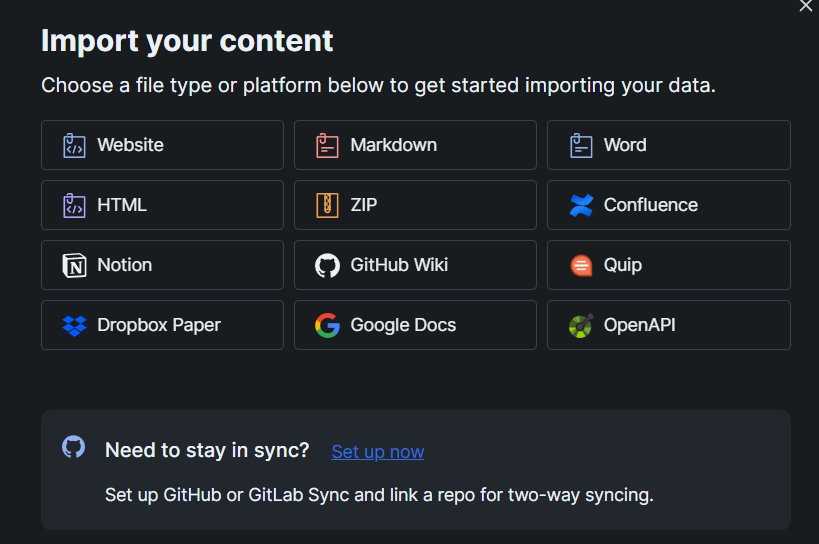

# Gitbook

El tener una base de conocimiento "knowledge base" es de suma importancia dentro de las organizaciones dada la rotación de colaboradores dentro de los proyectos, suele ocurrir que los proyectos una vez terminados se pasa a otro y cuando llega el momento de mantenimiento es un problema, al menos para un servidor que tiene una memoria de corto plazo. Por lo que es sumamente importante tener documentado los proyectos, con herramientas de fácil uso.

Gitbook es una herramienta desarrollada como un proyecto node, la librería es de fácil se basa en archivo MarkDown.

## Descarga

El repositorio de npm

[https://www.npmjs.com/package/gitbook](https://www.npmjs.com/package/gitbook) en el enlace es posible tener los pasos de instalación de la librería, por lo que me centraré en los primeros pasos para la generación de los archivos y en las opciones de despliegue "de bajo costo".

## Iniciar GitBook

Al iniciar gitbook se genera la estructura de archivos requeridos para la visualización inicial de los archivos, el comando para realizar este paso es:

```shell
gitbook init 
```

El resultado de este comando es la creación de README.md y SUMMARY.md, este último es nuestro archivo de direccionamiento del contenido de nuestra base de conocimiento. El archivo README.md sirve como índex y te recomiendo ocuparlo en el home de tu proyecto, ya que al momento de construir el proyecto te marcará un error como este

**FileNotFoundError: No "README" file (or is ignored)**

Así que ocúpalo como portada o como en este proyecto donde es mi CV, posterior organice los temas en directorios.

La organización en directorios te ayudará a gestionar los temas y en el SUMMARY.md se indican los títulos y el path del contenido que se mostrará. Ejemplo de este proyecto.

```markdown
* [Perfil](README.md)
* [Heroku](portafolio/heroku.md)
* [Gitbook](portafolio/gitbook.md)
```

## Despliegue

Entre las opciones tenemos [Heroku](https://personal-59.gitbook.io/personal-blog/heroku) proyecto serverless que ya documenté en el enlace de este blog. La segunda opción es la integración con la plataforma de [Gitbook](https://www.gitbook.com/), una vez registrado solo se requiere importar el contenido de tu repositorio de GitHub, GitLab o cualquiera de las siguientes opciones disponibles en la plataforma:

&#x20;&#x20;

En mi caso lo sincronizo con GitHub y la integración tarda unos minutos 

&#x20;

Una vez sincronizada nuestra cuenta nos solicita seleccionar el repositorio donde estamos versionando nuestra base de conocimiento, doy por hecho el entendimiento que tiene valor agregado que tiene el versionamiento, en todo caso este tema merece un post propio que podrás leer aquí.


Por último el paso de la publicación, en la parte superior tendremos la opción de publicar el contenido y las diferentes modalidades con las que se cuentan.


El contenido privado tiene una cuota por lo que recomendaré otra opción para este caso dentro del post de gitlab.

De ser necesario es posible realizar un cambio de url de publicación, o conexión con su propio DNS, esta opción está en _**Link and domain settings**_

&#x20;
